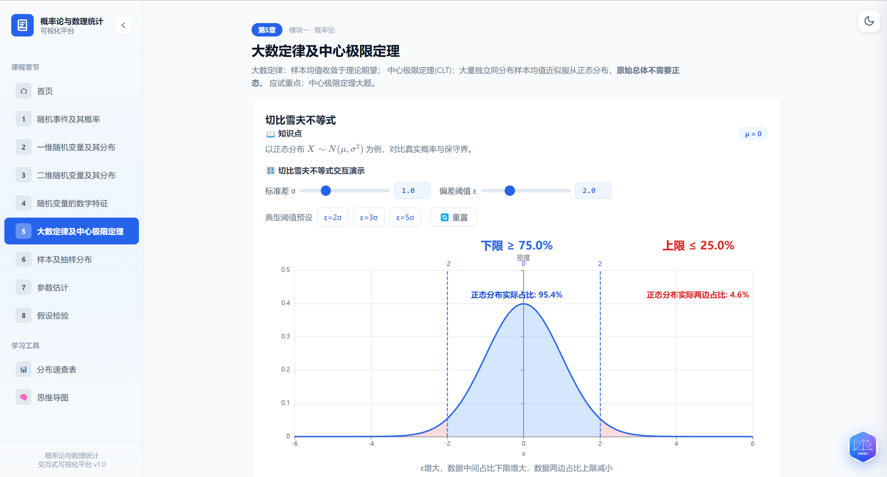
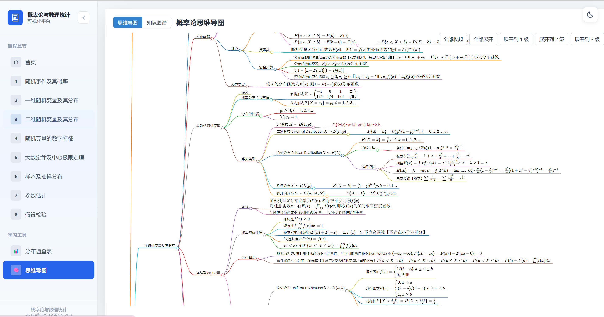
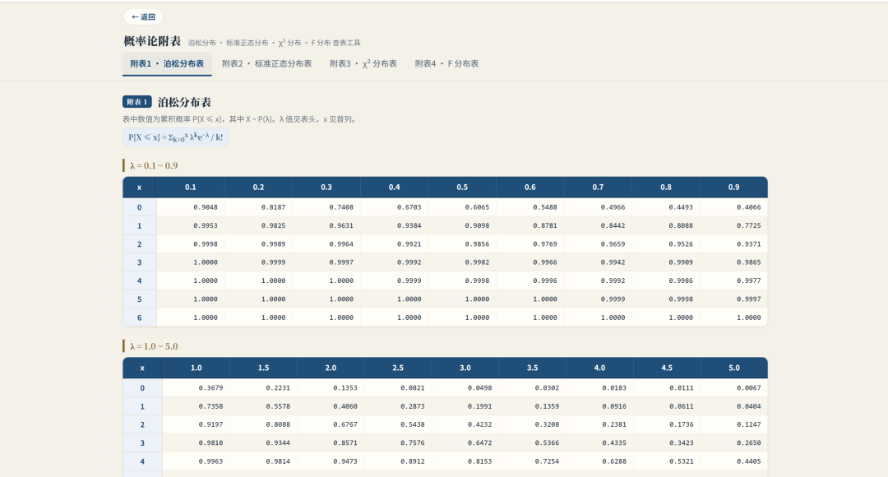
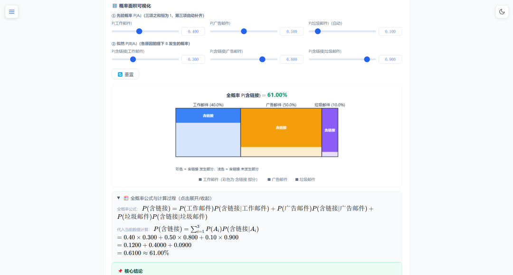

<p align="right"><a href="README.md">中文</a></p>

# Probability & Mathematical Statistics · Interactive Visualization Teaching Platform
# 概率论与数理统计 · 交互式可视化教学平台

A **fully static, zero external-request** visualization website for Probability & Mathematical Statistics. Slider-driven interactions, live charts, collapsible formulas and self-tests help undergraduate classes and self-learners build intuition and master exam-focused points.

一个**纯静态、零依赖外部请求**的概率论与数理统计可视化教学网站。通过滑块交互、实时图表、折叠公式与自测题，帮助本科课堂与自学者直观理解概念、抓住应试考点。

## Features / 特性

- **Fully offline**: All third-party libraries (Tailwind / KaTeX / ECharts / Plotly) and mind-map dependencies (d3 / markmap) are local copies; the pages make no external CDN requests.
- **12 pages + 1 data file**: 8 chapter pages + home page + 3 learning-tool pages + mind-map data source.
- **Interactive visualization**: Sliders with two-way binding to number inputs; drag to see probability distributions, density curves, 3D surfaces and simulation results update in real time.
- **Exam-oriented**: Each chapter ends with 3 single-choice self-tests that grade on click and explain; cards embed 💡 exam tips (light yellow) and 📌 key-conclusion boxes (correcting intuition pitfalls).
- **Formula rendering**: KaTeX renders inline body formulas and structured formula slots, and supports dynamic rewriting (e.g. the Bayesian "live formula").
- **Collapsible side navigation**: Grouped into "Chapters / Tools"; collapse state persisted in localStorage; overlay mode with responsive adaptation on mobile.

## Screenshots / 网站示例

**Home / 首页** — Hero section, chapter navigation and course intro


**Chapter 5 · Law of Large Numbers & CLT / 大数定律及中心极限定理** — Interactive Chebyshev inequality demo: adjust σ and ε with sliders to compare the conservative bound with the true normal probability



**Mind map tool / 思维导图** — Full-book knowledge tree rendered by markmap, with collapse / zoom / recursive expand and KaTeX-rendered formulas



**Probability appendix / 概率论附表** — Poisson / standard Normal / χ² / F lookup tables



**Total probability formula · mosaic area chart / 全概率公式 · 马赛克面积可视化** — Decompose P(B) by prior events as areas; adjust priors and conditionals with sliders and watch the step-by-step derivation update live



## Directory Structure / 目录结构

```
website/
├── index.html                  # Home: intro, chapter nav, formula quick-view, exam focus, usage
├── chapter1.html               # Random events and probability
├── chapter2.html               # One-dimensional random variables and distributions
├── chapter3.html               # Two-dimensional random variables and distributions (Plotly 3D surface)
├── chapter4.html               # Numerical characteristics of random variables
├── chapter5.html               # Law of large numbers and central limit theorem
├── chapter6.html               # Samples and sampling distributions
├── chapter7.html               # Parameter estimation
├── chapter8.html               # Hypothesis testing
├── appendix.html               # Tool: probability tables (Poisson / Normal / χ² / F)
├── mindmap_markmap.html        # Tool: full-book mind map + knowledge graph (markmap)
├── bayes_replacer.html         # Tool: Bayes / total-probability event replacer
├── 概率论思维导图.md            # Mind-map data source, fetched by the mind-map page
├── css/
│   ├── sidebar.css             # Sidebar styles + collapse animation + responsive
│   └── theme.css               # Light/dark theme (shared)
├── js/
│   ├── sidebar.js              # Sidebar component (single nav source + collapse persistence)
│   ├── theme.js                # Light/dark theme toggle
│   ├── katex-setup.js          # KaTeX auto-render + MutationObserver
│   ├── d3.v7.min.js            # Mind-map dependency (local)
│   ├── markmap-lib.js          # Mind-map dependency (local)
│   └── markmap-view.js         # Mind-map dependency (local)
├── vendor/                     # Local copies of third-party libs, zero external requests
│   ├── tailwind.min.js         # TailwindCSS local build
│   ├── echarts.min.js          # ECharts 5.4
│   ├── plotly.min.js           # Plotly.js 2.32.0
│   └── katex/                  # KaTeX 0.16
│       ├── katex.min.css
│       ├── katex.min.js
│       ├── auto-render.min.js
│       └── fonts/              # Font files, referenced by katex.min.css
└── logo.png                    # Site favicon
```

## Running Locally / 本地运行

### Option 1: Double-click (quick preview)

All HTML files sit at the same level as `css/`, `js/`, `vendor/`. In this flat layout you can simply double-click `index.html` to open it under the `file://` protocol; chapter and tool pages run normally.

> ⚠️ **Exception**: `mindmap_markmap.html` reads data via `fetch('./概率论思维导图.md')`. Browsers block this under `file://` due to CORS (the page shows a red error message). This page must be opened through a local HTTP server — see Option 2.

所有 HTML 与 `css/`、`js/`、`vendor/` 同级，扁平结构下可直接双击 `index.html` 以 `file://` 协议打开，章节页、工具页均可正常运行。`mindmap_markmap.html` 因 `fetch` 读取 `.md` 在 `file://` 下会被 CORS 拦截，需走本地 HTTP 服务。

### Option 2: Local HTTP server (recommended, includes the mind-map page)

Start any static server from the project root, e.g.:

```bash
# Python
python -m http.server 8000

# or the VS Code "Live Server" extension: right-click index.html → Open with Live Server
```

Then visit `http://localhost:8000/`.

## Deployment / 部署

After all pages are complete, push to GitHub and enable **GitHub Pages** for online access (served over HTTP, so `fetch` and the mind-map page work normally).

全部页面完成后上传 GitHub，开启 **GitHub Pages** 即可线上访问（走 HTTP，`fetch` 与思维导图页均正常工作）。

## Usage / 使用说明

1. Switch chapters / tools via the left navigation.
2. Drag sliders to change parameters and watch charts update live.
3. Expand collapsible panels to view exam formulas and step-by-step derivations.
4. Test your understanding with the self-tests at the end of each chapter (re-answerable, no scoring or persistence).

通过左侧导航切换章节 / 学习工具；拖动滑块修改参数观察图表实时变化；展开折叠面板查看考试公式与逐步推导；每章末尾自测题检验掌握程度（可反复重答，无计分与持久化）。

### Learning Tools / 学习工具

- **Distribution tables (appendix)**: Poisson / Normal / χ² / F lookup tables, reachable from the sidebar "分布速查表" entry.
- **Mind map**: The full-book knowledge tree with collapse / zoom, right-click recursive expand, and hover path; edit only `概率论思维导图.md` to change content.
- **Bayes event replacer**: Generalizes the disease-test case into any two events A, B, with 4 presets (disease test / spam mail / credit-card fraud / rain forecast) to convey the universal nature of Bayesian inference.

## Tech Stack / 技术栈

| Capability | Technology |
|---|---|
| Styling | TailwindCSS (local build, runtime compile) |
| Formulas | KaTeX 0.16 |
| 2D charts | ECharts 5.4 |
| 3D surface / contour | Plotly.js 2.32.0 (chapter3 only) |
| Hand-drawing & frame animation | Native Canvas 2D (Venn diagram, Bayesian area chart, dice animation) |
| Mind map | markmap + d3 v7 (local) |

## Maintenance & Extension / 维护与扩展

- **Add a page**: Append one entry in `js/sidebar.js`'s nav list (the nav is the single source of truth — do not hard-code `<a>` in pages); if it is a chapter page, also add a card in `index.html`'s chapter section; and register the new ECharts instance in this page's `window.resize` listener.
- **Edit formulas / knowledge points**: Use `\(...\)` in body text, or `<span class="katex-render" data-expr="...">` for structured formula slots.
- **Edit the mind map**: Only edit `概率论思维导图.md`; no need to touch the HTML.

> For teaching use only · © 2026
> 本平台仅供教学使用 · © 2026
